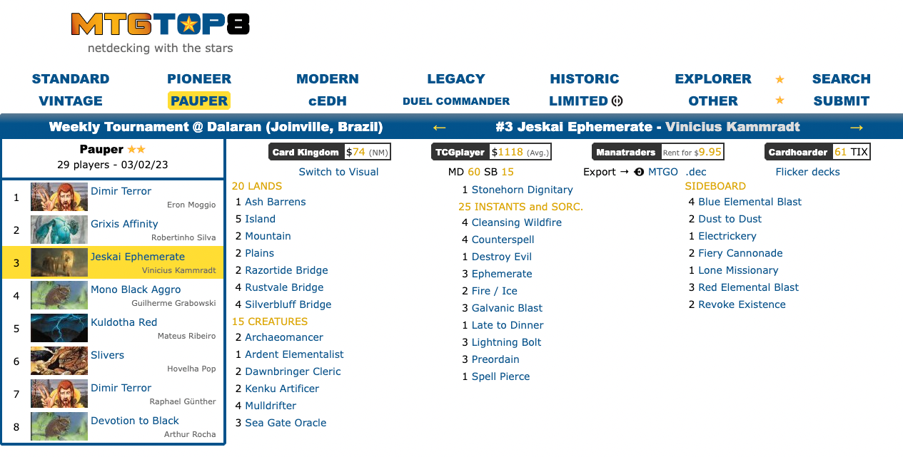
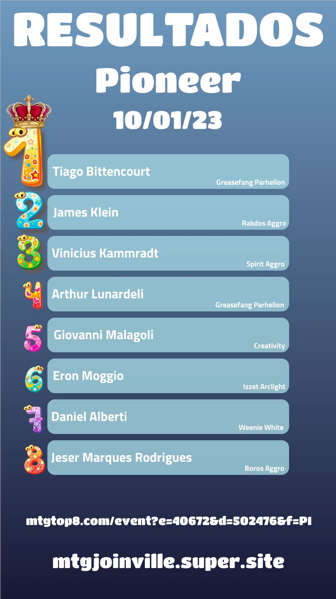

<h1 align="center">Welcome to MTGTop8 scrapper 👋</h1>


<div align="center">
    
</div>

<p>
  
  <a href="https://twitter.com/kammzinho" target="_blank">
    
  </a>
</p>

> Scrape data from MTGTop8, Magic the Gathering tournaments, results and decks into simple reports.


## How it looks

### Convert this:



### Into this:


https://user-images.githubusercontent.com/34798570/220813931-7d3d73db-6b1e-4564-86ea-8583ba12509a.mov


## Why?
- 🥹 Mixing coding and Magic 💛
- 🎲 Being able to extract & format in a fast/easy way is really helpful, so it's possible to play with it around later.    
- 📈 Reports are being used to generate Monthly Retrospectives related to the weekly tournaments around the city.  
- 🧑‍💻 All of them are available [here, in mtgjoinville.super.site](https://mtgjoinville.super.site/)

### The current ecosystem

- [MTG Joinville Website](https://mtgjoinville.super.site/)
  - 😉 Entrypoint for a bunch of information related to Magic in our city 
- [MTGTop8 Scrapper](https://github.com/kammradt/mtgtop8-scrapper)
  - 🪓 Will gather data from the main website that holds results from many tournaments
- [MTG Top/Ranking generator?]
  - Use reports from [MTGTop8 Scrapper](https://github.com/kammradt/mtgtop8-scrapper) to build social media ready images showing top 8 players and their decks. 
  - This is being currently build and there are some [examples/prototypes here](https://mtgjoinville.super.site/noticias/janeiro2023-piooner-retrospectiva).
  - <details>

      <summary>Some image examples</summary>

      
      
    </details>

## Install
> None of the builds/versions will probably be stable. This is a kind of pet project, so use at your own risk.

```sh
gem install mtgtop8_scrapper
```

## Usage

> Feel free to copy it from examples.rb file

```ruby
require 'mtgtop8_scrapper'

link = 'https://www.mtgtop8.com/event?e=41158&d=505864&f=PAU'

# Just create an instance passing a link as argument
scrapper = MTGTop8Scrapper.new(link)

# This generates and returns a report
scrapper.generate_report
# That you can also access later
puts scrapper.report

# You can also save the report locally as json
scrapper.save_report_locally_as_json
```


## Author

👤 **Vinícius Kammradt**

* Website: https://kammradt.super.site
* Twitter: [@kammzinho](https://twitter.com/kammzinho)
* Github: [@kammradt](https://github.com/kammradt)
* LinkedIn: [@vinicius-kammradt](https://linkedin.com/in/vinicius-kammradt)

## Show your support

Give a ⭐️ if this project helped you!
